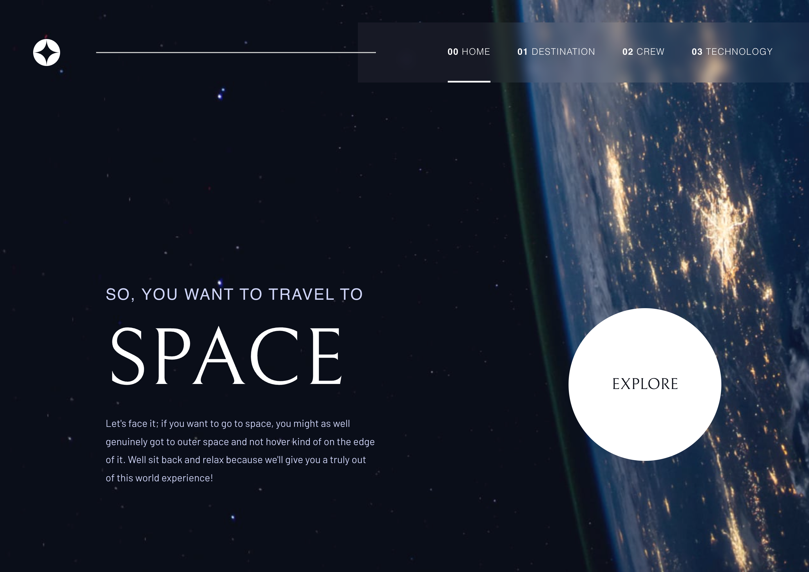

# Frontend Mentor - Space tourism website solution

This is a solution to the [Space tourism website challenge on Frontend Mentor](https://www.frontendmentor.io/challenges/space-tourism-multipage-website-gRWj1URZ3). Frontend Mentor challenges help you improve your coding skills by building realistic projects.

## Table of contents

- [Overview](#overview)
  - [The challenge](#the-challenge)
  - [Screenshot](#screenshot)
  - [Links](#links)
- [My process](#my-process)
  - [Built with](#built-with)
  - [What I learned](#what-i-learned)
  - [Continued development](#continued-development)
  - [Useful resources](#useful-resources)
- [Author](#author)
<!-- - [Acknowledgments](#acknowledgments) -->

## Overview

### The challenge

Users should be able to:

- View the optimal layout for each of the website's pages depending on their device's screen size
- See hover states for all interactive elements on the page
- View each page and be able to toggle between the tabs to see new information

### Screenshot

### Links

- [Github Repo](https://github.com/s2i61m97o/fm-space-tourism)
- [Live Site](https://s2i61m97o.github.io/fm-space-tourism/)

## My process

### Built with

- Semantic HTML5 markup
- CSS custom properties
- Flexbox
- CSS Grid
- Mobile-first workflow
- [React](https://reactjs.org/) - JS library
- Next.js
- TypeScript

### What I learned

#### .mediaMatches()

The `.mediaMatch()` method can be used on the `Window` interface similarly to how CSS media queries work. This allowed me to set up a JavaScript media queries where needed. I create a useBreakpoint hook for reusability, with the desired breakpoint passed as a parameter, and the function returning true if equal to or above, and false if not.

### Continued development

### Useful resources

- [Learn Advanced React - Scrimba](https://scrimba.com/advanced-react-c02h) - Great course for learning about Reusability, Routing and Performance in React, with plenty of hands on (the keyboard) learning and critical thinking need. Not just a _"here's how you do it, now copy me"_ course.
- [Learn TypeScript - Scrimba](https://scrimba.com/learn-typescript-c03c) - Another great course from Scrimba, plenty of keyboard use and thinking for yourself to take concepts and putting it into real code.
- [Swiped Events NPM Package](https://www.npmjs.com/package/swiped-events) - allows for the addition of "swiped" events to event listeners. This is the npm package I used to allow users to swipe navigate through the content of this projects pages.

## Author

- Frontend Mentor - [@s2i61m97o](https://www.frontendmentor.io/profile/s2i61m97o)
- X - [@mattyjsimmo](https://www.x.com/mattyjsimmo)

<!-- ## Acknowledgments -->
